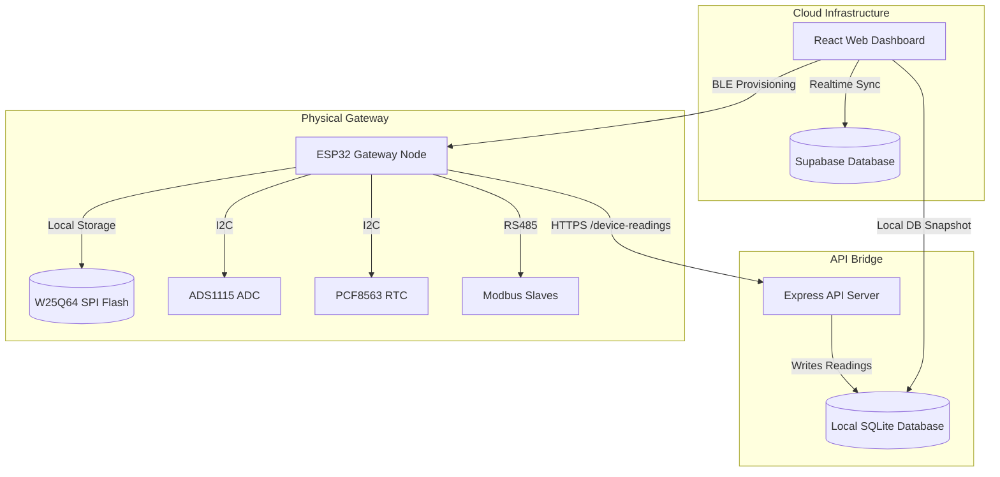
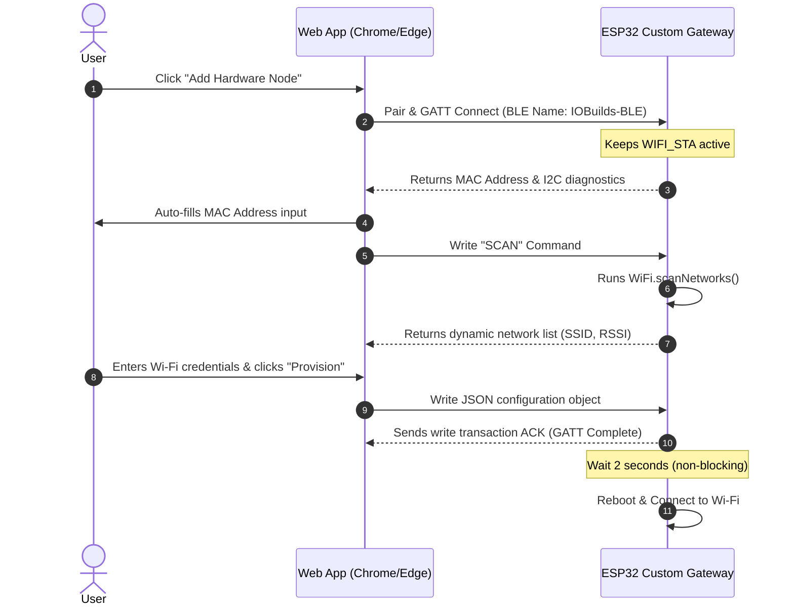
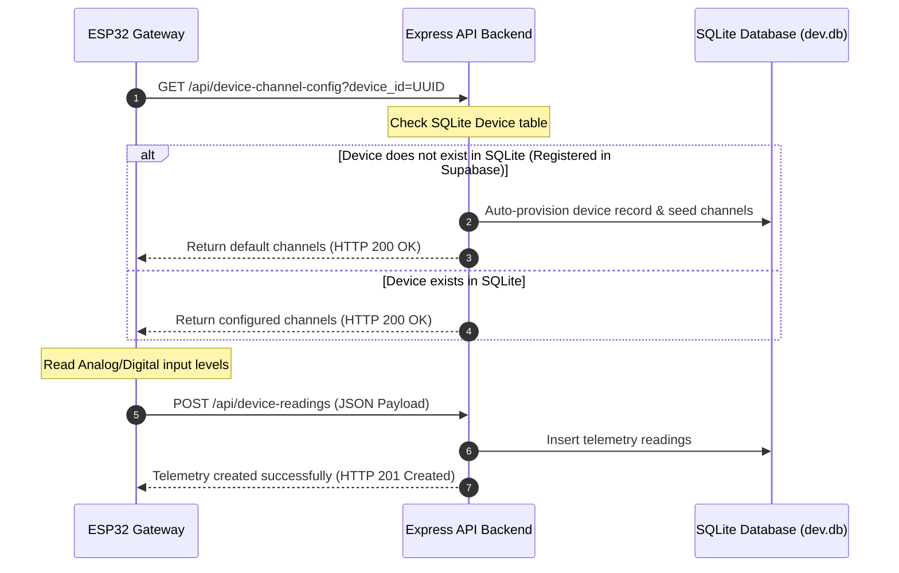
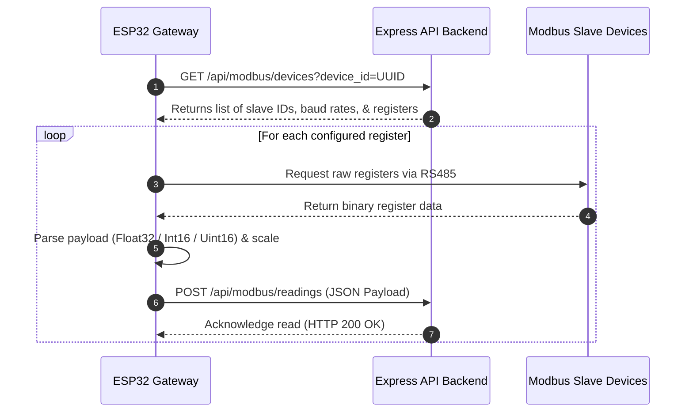
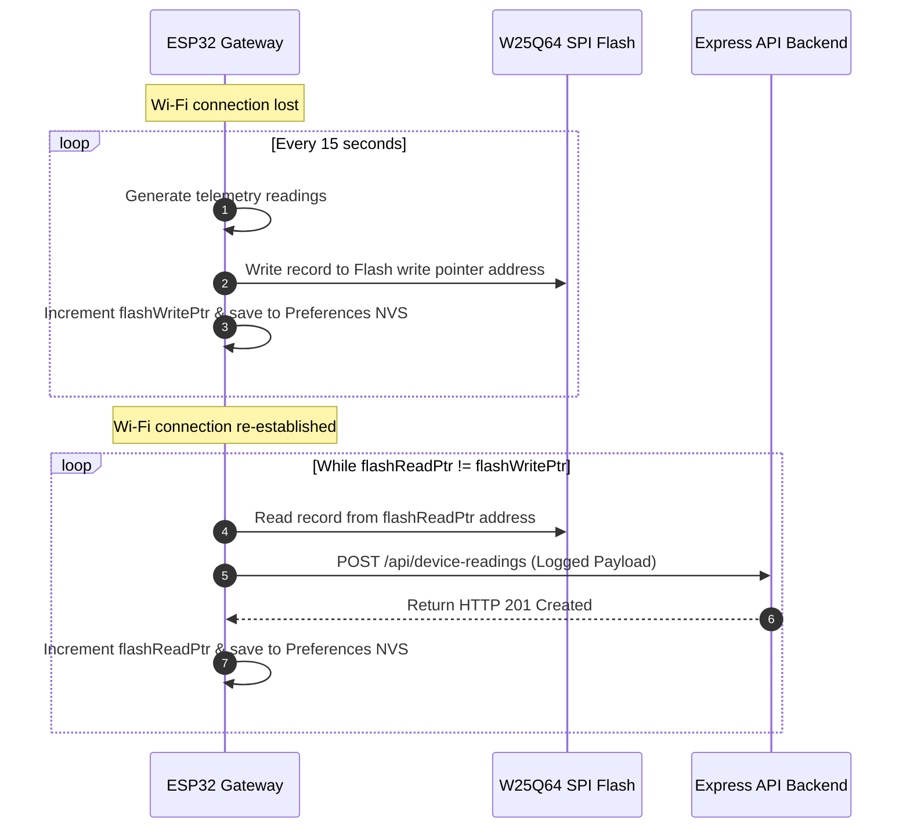

# BBJSENSE Telemetry Gateway & Control System
## System Architecture & Technical Documentation

This document describes the full working architecture of the BBJSENSE Telemetry Gateway, covering the web console frontend, the Supabase database layers, the local Express API backend server, and the ESP32 firmware loops.

---

## 📌 System Overview

The BBJSENSE system consists of four primary components working in synchronization:
1. **Frontend App (Vite + React)**: A responsive Web Dashboard (deployed at `bbjdemo.iobuilds.com`) using Supabase Auth and Database for real-time telemetry rendering and user management.
2. **Express API Gateway Server (Node.js)**: Runs alongside the dashboard to serve as an intermediate HTTPS gateway for the embedded nodes, handling configs, telemetry ingest, and Modbus device registries.
3. **ESP32 Gateway Firmware (C++/Arduino)**: The physical firmware flashed onto the custom PCB that monitors analog/digital inputs, handles RS485 Modbus RTU communication, logs data to SPI Flash during outages, and handles BLE provisioning.
4. **Mock Simulator Firmware**: A specialized version of the firmware designed for standalone ESP32 development boards that simulates sensors and Modbus registers to facilitate dashboard testing.



---

## 🔌 Hardware Pinout Configuration

The gateway runs on an ESP32 custom PCB (ESP32-D0WD-V3). The pinout configuration is mapped as follows:

| Peripherals / Ports | Hardware Mappings | Pin Functionality | Active Logic |
| :--- | :--- | :--- | :--- |
| **I2C Bus** | SDA: `GPIO 21`, SCL: `GPIO 22` | Connects PCF8563 RTC & ADS1115 ADC | Standard I2C |
| **Digital Inputs** | DIN1: `34`, DIN2: `35`, DIN3: `14`, DIN4: `12` | Optocoupler PC817 isolated inputs | Active-LOW |
| **Relay Outputs** | RELAY1: `36`, RELAY2: `32`, RELAY3: `27`, RELAY4: `25` | Outputs driving high-current relays | Active-HIGH |
| **Status LED** | WS_PIN: `GPIO 4` | NeoPixel WS2812 RGB state indicator | Dynamic |
| **TX LED** | LED_TX_PIN: `GPIO 13` | Flashes during HTTP transmissions | Active-HIGH |
| **RS485 Transceiver** | TX: `2`, RX: `15`, DIR: `33` | Serial1 connection to Modbus RTU network | DE/RE Toggle |
| **SPI Flash (W25Q64)** | CS: `5`, CLK: `18`, MISO: `19`, MOSI: `23` | Circular queue data logger | Standard SPI |
| **Function Button** | FUNC_BUTTON_PIN: `GPIO 39` | Multi-function button for factory reset | Auto-Polarity |

---

## 🔄 Core Sequences & Diagrams

### 1. BLE-Assisted Provisioning Flow
Provisioning initializes the Wi-Fi credentials, device identifier, and API gateway URL without hardcoding.



### 2. Live Telemetry & Auto-Provisioning Bridge
Handles data transmission and config syncing. In addition, it connects the cloud database registries with the SQLite database of the API gateway.



### 3. Modbus RTU Polling & Server Uploads
The gateway loops through server-defined Modbus device profiles and uploads mapped register values.



### 4. Offline Logging & Recovery
Prevents data loss during network outages by logging data locally to the SPI Flash.



## 🌐 Hardware & Server Connection Architecture

The telemetry gateway serves as an electrical-to-cloud bridge, translating physical signal voltages and Modbus industrial protocols into Express-compatible JSON data packages.

### 1. Electrical Signal Digitization & Scaling
*   **Analog Input Channels (0-10V or 4-20mA)**: 
    *   The industrial inputs pass through custom opto-isolated front-end filters.
    *   The signals are digitized by an **ADS1115 16-bit Sigma-Delta ADC** communicating over I2C (`SDA=21, SCL=22`).
    *   The gateway reads the raw voltage and calculates loop current: $I_{\text{mA}} = V_{\text{raw}} / 0.15$.
    *   Using linear interpolation, the firmware scales values relative to server-configured ranges:
        $$\text{Scaled Value} = \text{Min} + \left(\frac{I_{\text{mA}} - 4.0}{16.0}\right) \times (\text{Max} - \text{Min})$$
*   **Opto-Isolated Digital Inputs**:
    *   Four digital input channels (active-LOW) represent dry contact or level switches.
    *   Bypassed through internal debounce filters and serialized as boolean values.

### 2. Secure HTTPS Connection Specs
*   **Transport Layer**: TLS 1.2 secure client socket connection (`NetworkClientSecure`).
*   **Handshake Bypass**: Bypasses root CA certificate verification using `client.setInsecure()`, eliminating the overhead of managing certificates on embedded hardware.
*   **Timeout Guard**: Explicitly set to `http.setTimeout(10000)` (10 seconds) to prevent TCP handshakes or poor signals from stalling loop operations.
*   **DNS Resolution Diagnostic**: Includes pre-request `WiFi.hostByName()` lookup to output clear router/internet connection errors in local logs.

### 3. API Payload JSON Schema Contracts

#### A. Main Telemetry Endpoint (`POST /api/device-readings`)
Pushes localized ADC and DIN status periodically (default 15 seconds) to the database.
```json
{
  "device_id": "62fc163f-e804-4676-a221-731232a67a47",
  "analog_ch1": 68.42,
  "analog_ch1_mode": "4-20mA",
  "analog_ch2": 2.15,
  "analog_ch2_mode": "0-10V",
  "analog_ch3": 0.0,
  "analog_ch3_mode": "0-10V",
  "analog_ch4": 0.0,
  "analog_ch4_mode": "0-10V",
  "digital_in1": true,
  "digital_in2": false,
  "digital_in3": false,
  "digital_in4": false,
  "digital_out1": false,
  "digital_out2": false,
  "digital_out3": false,
  "digital_out4": false,
  "rtc_time": "2026-07-06T10:23:10Z"
}
```

#### B. Event Logger Endpoint (`POST /api/device-events`)
Allows the ESP32 to report startup boot parameters, I2C bus errors, or manual reset triggers to the admin console.
```json
{
  "device_id": "62fc163f-e804-4676-a221-731232a67a47",
  "event_type": "critical",
  "message": "I2C Sensor Bus Initialization Failed (ADS1115 or PCF8563 unresponsive)"
}
```

#### C. Modbus Readings Endpoint (`POST /api/modbus/readings`)
Pushes register readings polled from Modbus slave devices over RS485 Serial.
```json
{
  "modbus_device_id": "426e2cb0-76d6-4158-b0be-a092cab78c78",
  "register_id": "8af76cde-129a-4eab-89cd-09a7b716ca32",
  "raw_value": "01f3",
  "scaled_value": 49.9
}
```

### 4. Outage Outbox Buffer & Synchronization
*   If the gateway receives an HTTP response other than `200` / `201` (or fails to connect), it enters the Offline state.
*   **Storage Loop**: Serializes the standard telemetry JSON schema and writes it as a plain-text string directly to a circular queue inside the **W25Q64 SPI Flash**.
*   **Pointer Registry**: Writes the new write pointer address `flashWritePtr` to the ESP32's non-volatile storage (NVS) using Arduino `Preferences`.
*   **Sync Recovery**: Once Wi-Fi reconnects, it initiates a FIFO (First-In, First-Out) reading scan from `flashReadPtr` to `flashWritePtr`. Pushes each logged record to `/device-readings` sequentially, incrementing and committing `flashReadPtr` in NVS only upon getting an `HTTP 201 Created` confirmation.

---

## 🛡️ Fail-Safe Mechanisms & Stability Policies

To ensure uninterrupted industrial operations, the system implements the following fail-safe measures:

1. **80 ms Software Debouncing**:
   The input pin reading is filtered through an 80 ms debounce window. Rapid voltage spikes or contact bounce noise will not trigger accidental configurations reset.
2. **5-Second RF Startup Ignore**:
   During initial boot, turning on the high-power BLE radio causes minor voltage spikes on GPIO 39. The button handler completely ignores all transitions for the first 5 seconds to bypass this transient startup noise.
3. **Auto-Polarity Calibration**:
   On boot, the ESP32 reads the input pin state for 300 ms. If it reads `HIGH`, the button is automatically configured as active-LOW (pressed = `LOW`). If it reads `LOW`, the button is configured as active-HIGH (pressed = `HIGH`).
4. **HTTP Client 10s Timeout Limit**:
   An explicit 10-second timeout is configured on all HTTPS calls (GET and POST). If the server is offline or the network drops, the request will immediately fail-fast and allow the main loop to continue running instead of freezing the controller thread.
5. **Non-Blocking BLE Provisioning Restart**:
   When Wi-Fi configurations are successfully written over BLE, the gateway schedules a reboot in 2 seconds instead of restarting immediately. This gives the client browser enough time to receive the GATT write acknowledgement and close the connection cleanly.
6. **NVS Factory Reset**:
   Holding the function button (GPIO 39) for 10 seconds triggers a factory reset. The RGB status LED blinks rapidly in **RED** during the hold, flashes **WHITE** 10 times upon success, wipes all configurations from NVS memory, and restarts the module back into BLE provisioning mode.
