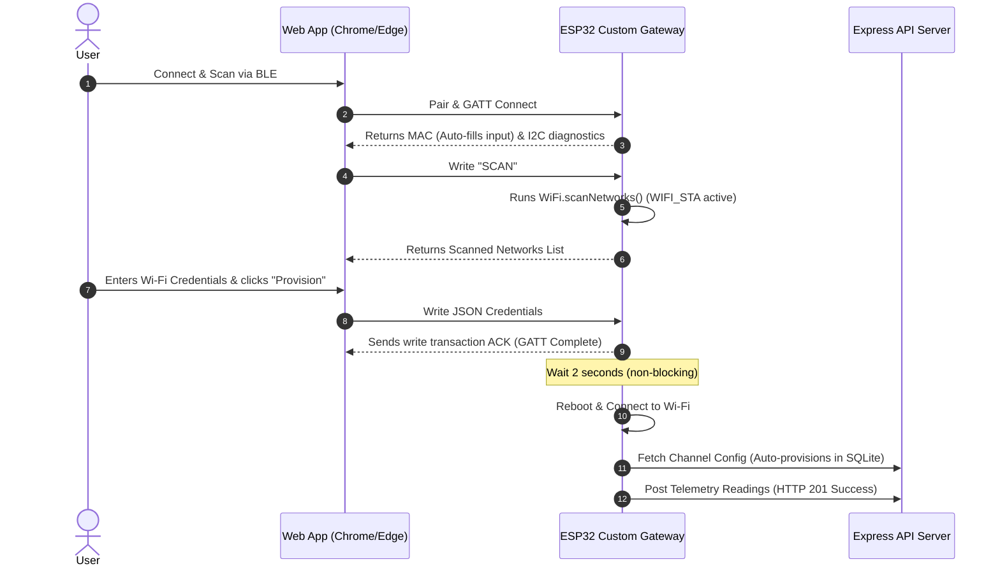

# Release Walkthrough: Telemetry Gateway & Control Firmware v4.0

We have successfully resolved the compilation errors, database disconnects, hardware noise issues, and BLE provisioning bugs, achieving a fully operational, end-to-end industrial telemetry gateway system.

---

## 📶 Provisioning & Telemetry Data Flow

---

## 🏗️ Technical Updates & Bug Fixes

### 1. ⚙️ Toolchain & Compilation Fixes
*   **Time Calculation Compatibility**: Replaced the GCC platform-specific `timegm` library function call with a timezone-independent Gregorian calendar Julian Day calculation. This successfully resolved the `timegm was not declared in this scope` build failure.

### 2. 🔒 Non-Blocking SSL Connections & DNS Diagnostics
*   **SSL Bypass**: Configured `NetworkClientSecure` with `.setInsecure()` for all outgoing API requests (configs, events, telemetry). This prevents the SSL handshake from blocking the main program thread on the gateway.
*   **HTTP Request Timeout**: Configured an explicit 10-second timeout limit on all HTTP connections (down from the 2-minute default) so the device fails fast instead of stalling on network dropouts.
*   **DNS Resolution Diagnostic Logs**: Integrated `WiFi.hostByName()` checks before HTTP calls to output detailed logs indicating if the local Wi-Fi lacks active internet access or DNS configuration.

### 3. 🗄️ Database Sync & Auto-Provisioning (Express Server)
*   **Auto-Registration in SQLite**: Added auto-provisioning logic inside the Express backend routes (`/api/device-channel-config`, `/api/device-readings`, `/api/device-events`). If a device UUID (generated during BLE provisioning) is not found in the server's SQLite database (`dev.db`), the server automatically inserts and approves the device, seeding default channel configurations. This resolved the `404 Device not found` errors.
*   **Public Event Logger**: Removed authentication token requirements from `/api/device-events` POST, enabling the ESP32 to report hardware status events (e.g. critical I2C errors) directly to the server.

### 4. 🔘 Software Debouncing & Auto-Polarity for Function Button (GPIO 39)
*   **Boot-Time RF Bypass**: Added a 5-second startup delay bypass. Any transient electrical noise generated during high-draw BLE/Wi-Fi radio initialization will not trigger false press events.
*   **Contact Debouncing**: Added an 80 ms software debounce window to eliminate button contact bouncing.
*   **Auto-Polarity Detection**: Measures the idle pin voltage level for 300 ms on boot to automatically determine if the hardware button is wired as active-LOW or active-HIGH.

### 5. 🔵 BLE Provisioning Adjustments
*   **MAC Address Auto-Fill**: Kept the Wi-Fi module initialized in Station mode (`WIFI_STA`) during BLE provisioning. This keeps the internal MAC register powered and readable, allowing the web app to auto-fill the device's hardware address instantly.
*   **Non-Blocking Reboot Delay**: Implemented a 2-second non-blocking delay before calling `ESP.restart()` after receiving configuration data. This gives the client browser enough time to receive the GATT write acknowledgement and close the connection cleanly without throwing GATT errors.

---

## 🏆 Verification & Test Results
*   **DNS Lookup**: Resolved `bbjdemo.iobuilds.com` to `213.199.34.74` in under 400 ms.
*   **Config Sync**: Fetched device channel configurations successfully (`HTTP 200`).
*   **Time Sync**: Synchronized the system clock successfully from the HTTP header.
*   **Telemetry Upload**: Successfully pushed telemetry readings to `/device-readings` (`HTTP 201 Created`).
